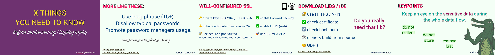
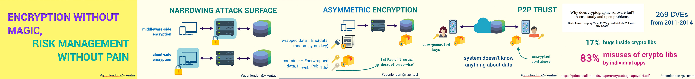
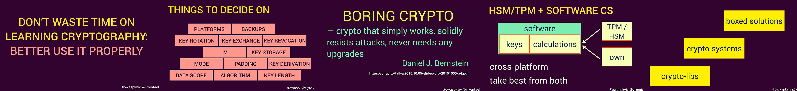
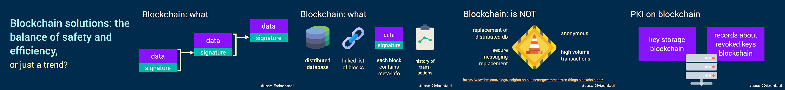
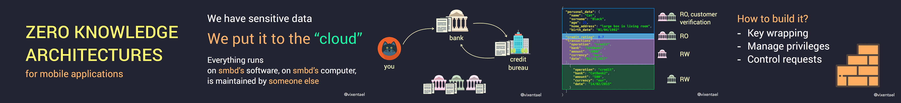
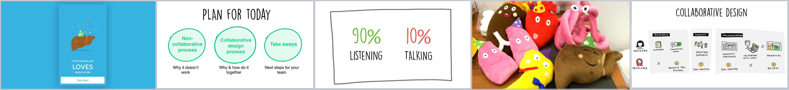
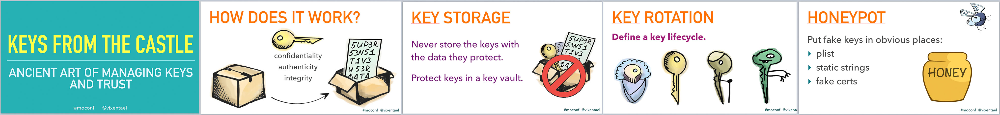
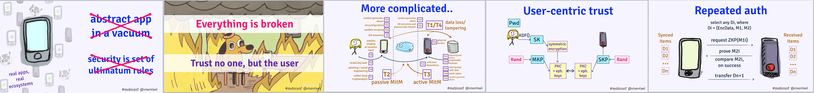
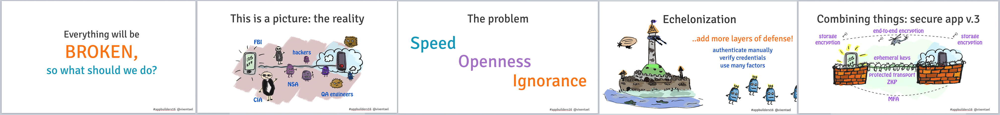
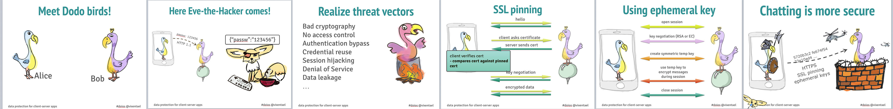

A list of topics I speak about on the different conferences, including posts, videos, slides etc. I track resources on my own, so maybe I'm missing smth.

---------------------

I'm working at [@cossacklabs](http://twitter.com/cossacklabs) on security products that provide strong, usable cryptography for busy people. Many things are open source, i.e. [Themis](https://github.com/cossacklabs/themis) — the crypto library for storage and messaging in mobile, desktop, and web apps, or [Acra](https://github.com/cossacklabs/acra) — database proxy with intrusion detection. 

I can assist you in protecting users data in your infrastructure, just drop me an [email](mailto:anastasi@cossacklabs.com).

I share a lot about my engineering life on twitter as [@vixentael](https://twitter.com/vixentael), and on [Medium](https://medium.com/@vixentael).

Enjoy! 🔒

---------------------

# Coming Soon

## Zero knowledge architecture approach for mobile developers [workshop] 🛠

\#mobile \#security \#ZKA

- [Swift Aveiro](http://swiftaveiro.xyz/#mentors) 
Aveiro, Portugal, 21-22 June 2018

---------------------

# 2018

## X Things you Need to Know before Implementing Cryptography

\#mobile \#security \#basic-sanity

[slides](https://speakerdeck.com/vixentael/x-things-you-need-to-know-before-implementing-cryptography) | video gonna be soon |
---- | --- |

Before we get deep into protocols vulnerabilities: things you should remember designing your app flow from a security point of view.

This talk will focus on copybook headings of infosec: what you need to know before exciting stuff like cryptography and AI-assisted incident detection. Like, choice of data you show in the background mode, choice of 3rd party SDKs, which logs we send and where...

Even when developers create apps with security in minds, protect user secrets, and don’t reveal unencrypted data, attackers can find ways to bypass these security measures by exploiting architectural weaknesses and unobvious, yet very simple vulnerabilities. We will talk about all the tiny bits and pieces are necessary to make your app secure against simple attacks way before focusing on the hard things (like crypto).

1. Handling user secrets with care (showing, storing, logging).
2. Input validation and password rules.
3. Handling transport connection.
4. And some tips and tricks that will confuse attackers.

**Presented at:**

- [UIKonf 18](http://www.uikonf.com/) 
Berlin, Germany, 13-16 May 2018

## Encryption Without Magic, Risk Management Without Pain

\#security \#crypto \#databases \#notmobile \#trust \#infrastructures \#separation-of-duties \#echelonization

[slides](https://speakerdeck.com/vixentael/encryption-without-magic-risk-management-without-pain) | [video](https://www.infoq.com/presentations/encryption-risk-management) |
---- | --- |

In-depth technical inquiry about cryptography in a wider context: how it helps to narrow more significant risks to controlled attack surfaces, enables managing the risk efficiently and elegantly, how tools and algorithms sit in a broader context of managing infrastructure-wide risks associated with handling sensitive data.

1. What is attack surface, how cryptography helps to narrow it. 
2. Simple crypto-systems, but significant downsides. 
3. Middleware-side encryption: protecting data in web-based infrastructures. 
4. Client-side encryption: trust to mobile apps and code execution. E2EE. ZKA. ZKP. 
5. Echelonization, and traditional techniques.

**Presented at:**

- [Security BSides Ukraine](https://securitybsides.org.ua/#speakers) 
Kyiv, Ukraine, 21 April 2018
- [QCon London 18](https://qconlondon.com/london2018/presentation/encryption-without-magic-risk-mngmnt-without-pain) 
London, UK, 5-7 March 2018

---------------------

# 2017

## Don’t waste time on learning cryptography: better use it properly

\#security \#crypto

[slides](https://speakerdeck.com/vixentael/dont-waste-time-on-learning-cryptography-better-use-it-properly) | [video (ru)](https://www.youtube.com/watch?v=SfuN-r3FpdY&feature=youtu.be)|
---- | --- |

Crypto in our lives: why you shouldn’t spend time learning all the details of the crypto-algorithms. Typical mistakes you make using crypto in your products. How to avoid late night commits, but to code 'fast and boring' instead.

1. The typical engineering workflow "we should protect the data, what shall we do", and possible mistakes. 
2. What is "boring crypto", what do we want from using crypto-products. 
3. Possible solutions: HSM / TPM / software crypto. 
4. How to select appropriate software crypto: libs, systems, containers. 
5. We want crypto to be similar to the Edison lamp: controllable and boring system.

**Presented at:**

- [Devexperience.ro](http://devexperience.ro/tracks/futuretech/) 
Iasi, Romania, 23 April 2018  

- [OWASP Kyiv Meetup Winter 17](https://www.facebook.com/events/134239973868217/) 
Kyiv, Ukraine, 2 December 2017 

## Blockchain solutions: the balance of safety and efficiency, or just a trend?

\#security \#blockchain

[slides](https://speakerdeck.com/vixentael/blockchain-solutions-the-balance-of-safety-and-efficiency-or-just-a-trend) | [video (ru)](https://www.youtube.com/watch?v=McTdjdYCrKo)|
---- | --- |

The security engineer's job is to choose the appropriate solutions for the problems and to apply them. Discussing blockchain regarding cryptography is rather boring: it is simple, and even some assumptions in high-level protocols do not cause protests.

I will talk about the other side - where blockchain looks like an optimal strategy, where it causes questions. We will walk through the risk&threats models, trust, and guarantees, to the experience of using blockchain in the real project (and what happened next).

**Presented at:**

- [UA.SC 17](https://www.facebook.com/events/119916742082061/) 
Kyiv, Ukraine, 18 October 2017 

## Zero Knowledge Architectures for mobile Applications 👌

\#security \#mobile \#zkp \#zka

[slides](https://speakerdeck.com/vixentael/zero-knowledge-architectures-for-mobile-applications) | [Mobiconf video (en)](https://www.youtube.com/watch?v=79iqPsPc6ZE&index=17&list=PLr5cF6ekyIDgWee0wtwMKSGcoMvt5fkn_) |
---- | --- |

With intensifying threat access, snooping governments and insecure-internet-of-everything, the importance of zero-knowledge application architectures and end-to-end trust, for things more complicated than simple messaging, becomes more and more obvious for the app developers.

We will talk about real-world problems that ZKA fights against, learn typical cryptographic designs and progress in different spheres of ZKA. We will find out how to make data sharing, user collaboration on data in the cloud with your app provably secure.

**Presented at:**

- [DevFest Baltics 17](https://devfest.gdg.lv/) 
Riga, Latvia, 17 November 2017 

- [SE Conf 17](https://se2017.indevlab.com/) 
Kyiv, Ukraine, 27-29 October 2017 

- [MobiConf 17](https://2017.mobiconf.org/) 
Krakow, Poland, 5-6 October 2017 

## Build it, not just solve it! 💊

\#ux \#productdev \#mobile \#design

[slides](https://speakerdeck.com/addc/addc-2017-anastasiia-voitova-anna-iurchenko-solve-it-dont-just-build-it) | [video](https://www.youtube.com/watch?v=JNWNdwuu1LE) |
---- | --- |

This is a story from a designer [@anatinge](https://twitter.com/anatinge) and a developer who worked together and built a product for people who really need it. It's all about working in a tight collaboration, conducting user research and user interviews, sharing tip & tricks about team working. 

**Presented at:**

- [ADDC 2017](http://addconf.com/) 
Barcelona, 22-23 June 2017

## Keys from the castle: ancient art of managing keys and trust 🔑

\#security \#keys \#mobile \#trust

[slides](https://speakerdeck.com/vixentael/keys-from-the-castle-ancient-art-of-managing-keys-and-trust) | [AppBuilders video](https://www.youtube.com/watch?v=5U3FfQUmcV4&feature=youtu.be) | [CraftConf video](http://www.ustream.tv/recorded/102860531) |
---- | --- | ---- |

We will talk about building trust. Trust is built around various trust tokens: keys, passwords, secrets, biometric properties, things you have and things you know. We will talk about what should you trust, how to establish and verify trust, how to share trustedly among different users. We will discuss technical aspects: key exchange, key trust, key derivation, channel trust, multi-factor authentications. I will try to make the audience understand how this huge universe of tools and algorithms serves just one purpose: letting the right guys in, keeping the wrong guys outside our magical castle. And fairies there should be!

\>\>\> [Read more in Medium post](https://medium.com/@vixentael/key-management-approaches-for-mobile-apps-57bb4db63906) \<\<\<

**Presented at:**

- [Mobile Optimized](https://mo.dev.by/) 
Minsk, Belarus, July 14-15 2017

- [CraftConf 17](https://craft-conf.com/) 
Budapest, Hungary, April 25-28, 2017 

- [AppBuilders 17](https://2017.appbuilders.ch/) 
Lausanne, Switzerland, April 24-25 2017

## App security for kittens 🐱

\#security \#mobile \#kittens

no slides | no video |
---- | ---- |

Summary talk for the newbies in security field. 

Mobile platforms present both new threats and new opportunities for system security. This presentation will deal with modern approaches: how to protect data, which trusted relationships emerge with mobile phone, how they affect traditional security layouts. I will tell you how mobile phones dictate important client-server relationships.

Based on my other talks.

**Presented at:**

- [Tech meetup on Cactus Hackathon](https://www.facebook.com/pg/cactushackaton/posts/) 
Kyiv, Ukraine, May 2017 

- [Women Who Code Kyiv meetup](https://www.meetup.com/Women-Who-Code-Kyiv/events/237823597/) 
Kyiv, Ukraine, March 2017

______________________________________________

# 2016

## Swift and Security [workshop] 🛠

\#security \#workshop \#mobile \#ssl

[slides](https://speakerdeck.com/vixentael/the-swift-alps-security-workshop) | no video | [github repo](https://github.com/TheSwiftAlps/theswiftalpsdemo)
---- | --- | ---- |

The idea was to share some knowledges about making more secure apps. We talked about:

- why SSL is not enough 
- strategies to implement SSL pinning 
- how to understand basic risks and threats of common mobile client-server infrastructure 
- protection methods against those threats 
- what is symmetric encryption; why we need it. where to store data and key. 
- what is transfer encryption; when we need it.

**Presented at:**

- [The Swift Alps](http://theswiftalps.com/) 
Crans-Montana, Switzerland, 10-11 Nov 2016

## Building user-centric security model in iOS applications 👥

\#security \#keys \#mobile \#trust

[slides](https://speakerdeck.com/vixentael/extended-version-building-user-centric-security-model-in-ios-applications) | [EatDog video, 1h (ru)](https://www.youtube.com/watch?v=h4egvZ4JuvI) | [MobiConf video, 40m (eng)](https://www.youtube.com/watch?v=QG-yw5iG564) |
---- | --- | ---- |

We will talk about building security, that does not fail when application keys are exposed; when servers are hacked; security that lasts as long as unique user's crypto keys (or passwords) are safe. Putting secrets known by the user to be a source of trust is the ultimate way for an app to become "thin" in relation to the security model, thus lowering the risks and developer pain. We will learn about thin transparent security layers system and its applicability in client-server systems.

\>\>\> [Check for transcript and video on Realm (25m)](https://realm.io/news/tryswift-anastasiia-voitova-building-user-centric-security-model-ios-applications-swift/) \<\<\<

**Presented at:**

- [MobiConf](https://2016.mobiconf.org/) 
Krakow, Poland, 6-8 Oct 2016

- [NSBarcelona](https://www.meetup.com/nsbarcelona/) 
Barcelona, Spain, 21 Sept 2016

- [NSSpain](http://2016.nsspain.com/) 
Logrono, Spain, 14-15 Sept 2016

- [try!swift](https://www.tryswift.co/) 
NYC, USA, 1-2 Sept 2016

- [EatDog](https://eatdog.com.ua/) 
Kharkov, Ukraine, 18 August 2016

## Multiskilled dev teams: unlock your hidden powers 🌩 

\#teammanagement \#development

[slides](https://speakerdeck.com/vixentael/multiskilled-mobile-dev-teams-unlock-your-hidden-powers) | [UMT video (ru)](https://www.youtube.com/watch?v=1aNeHW2VQD0) |
---- | --- |

Everyone is talking about developers' specialization. 'Know you niche'. We have separate conferences for every dev area now: mobile, cloud, big data, iOT. In order to build a modern multiplatform mobile app you need to work with separate iOS and Android dev teams, separate backend dev team, designers and managers. Doesn't look too much?
 
I'll talk about another way of organization: multiskilled dev team, experience and benefits.

**Presented at:**

- [AgilePizza #49 meetup](https://www.facebook.com/Scrumguides/) 
Kyiv, Ukraine, 26 July 2016

- [UaMobiTech](https://2016.mobiconf.org/) 
Dnipro, Ukraine, 18-19 July 2016

## Upgrading approaches to the secure mobile architectures 🛡

\#security \#trust \#mobile \#ZKP \#KDF

[slides](https://speakerdeck.com/vixentael/upgrading-approaches-to-the-secure-mobile-architectures) | [CocoaHeads Video (ru)](https://www.youtube.com/watch?v=elP6ABURwlA) |
---- | --- |

Mobile platforms present both new threats and new opportunities for system security. This presentation deals with modern approaches: how to protect data, which trust relationships emerge with mobile phone, how they affect traditional security layouts. How mobile phones dictate important client-server relationships.

But, what’s more important, we talk about making these things a consistent system: how to think to pick the right tools, which architectural patterns enforce security and minimize risks by design. We learn about ideas of echelonized defence, compartmentation and risk control. We finish with understanding where we stand right now: in security landscape that is rapidly changing, and mobile’s role in it is both dangerous and very important.

\>\>\> [Read more in Medium post](https://medium.com/@vixentael/upgrading-approaches-to-the-secure-mobile-architectures-7a8fcb10d28a) \<\<\<

**Presented at:**

- [AppBuilders 16](http://2016.appbuilders.ch/) 
Zurich, Switzerland, 25-26 Apr 2016

- [CocoaHeads Kyiv #9](https://www.facebook.com/CocoaHeadsUkraine/) 
Kyiv, Ukraine, June 2016

## Working with designs: make 💖 not ⚔️

\#teammanagement \#development \#design \#mobile

[slides](https://speakerdeck.com/vixentael/working-with-designs-make-love-not-war) | [video (ru)](https://www.youtube.com/watch?v=Q-Ah0GNxfbM) |
---- | --- |

As the developer, I don’t want to be frustrated when I need to convert designs into assets.

We will talk about: 

* lots of tools and ways how to save own time 
* how to communicate with designer, and 
* if it’s okay to change designs on our own
 

**Presented at:**

- [ITSubbota meetup](https://frameworksdays.com/event/ios-itsat) 
Kyiv, Ukraine, May 2016

______________________________________________

# 2015

## Avoiding damage, shame and regrets: data protection for mobile client-server architectures 💪

\#security \#trust \#mobile \#architecture

[slides](https://speakerdeck.com/vixentael/avoiding-damage-shame-and-regrets-data-protection-for-mobile-client-server-architectures) | [Do iOS video (eng)](https://www.youtube.com/watch?v=zKvt0fv_mkc) |
---- | --- |

- communication with server: security, reliability, ease of use, choose two 
- applied cryptography: should you manually configure CommonCrypto or ...? 
- practical example: protecting network transport without breaking the app 
- storage security: how to prevent anyone reading your secret chat messages

\>\>\> [Read more in Medium post](https://medium.com/stanfy-engineering-practices/data-protection-for-mobile-client-server-architectures-6e6dcabd871a#.d0wjnnp58) \<\<\<

**Presented at:**

- [CocoaHeads Kyiv](https://www.facebook.com/CocoaHeadsUkraine/) 
Kyiv, Ukraine, December 2015

- [CocoaConfBy](https://www.facebook.com/groups/iosby/) 
Minsk, Belarus, December 2015

- [do{iOS}](http://do-ios.com/) 
Amsterdam, Netherlands, November 2015

## Data transfer security for mobile apps: what the fish doesn’t notice in the ocean? 🐟

\#security \#mobile \#architecture

[slides](https://speakerdeck.com/vixentael/data-transfer-security-for-mobile-apps-what-the-fish-doesnt-notice-in-the-ocean) | no video |
---- | --- |

* Wise fish knows there ain’t enough talks about security 
* Communication with server: security, reliability, ease of use, choose two 
* Applied cryptography: should you manually configure CommonCrypto or …? 
* Network security is piranha in risk and ruff in implementation 
* Practical example: protecting network transport without breaking app

**Presented at:**

- [Lviv Mobile Dev Day](http://mdday.lviv.ua/) 
Lviv, Ukraine, October 2015

## Building profanity filters on mobile: clbuttic sh!t

\#mobile \#development \#nlp

[slides](https://speakerdeck.com/vixentael/building-profanity-filters-on-mobile-clbuttic-sh-t) | no video |
---- | --- |

Short story about building app with profanity text filter inside.

- profanity filters: why we need them in mobile at all? 
- handle tricky cases: what is wrong with word 'classic' 
- how to filter fast (strings vs sets) 
- gentle filtering not to scare users

**Presented at:**

- [ITSubbota meetup](https://frameworksdays.com/event/ios-itsat) 
Kyiv, Ukraine, September 2015

## Users' data security in iOS applications 📱

\#security \#mobile \#usersdata \#commoncrypto

[slides](https://speakerdeck.com/vixentael/users-data-security-in-ios-applications) | [video (ru)](https://www.youtube.com/watch?v=d5Fos3e6eo8) |
---- | --- |

* Why should we think about security at all.

* How to protect the users' data. Why shouldn't we store passwords. Encrypt database: it is necessary or too lazy to do that?

* How to transfer data to the server in a safe way. What is MitM attack? 

* What is password protection? Why snapshots and pasteboard are dangerous?

**Presented at:**

- [WebCamp](https://www.facebook.com/WebCamp) 
Odessa, Ukraine, July 2015

## Backend without code. Parse.com: myth and reality ☁️

\#backend \#mobile \#parse \#development

[slides](https://speakerdeck.com/vixentael/stanfy-madcode-meetup-number-5-backend-without-code-parse-dot-com-myth-and-reality) | [video (ru)](https://www.youtube.com/watch?v=qcbPvEdUCWY) |
---- | --- |

* How many developers are needed to write client-server mobile app? Fun and easy: set up a new app with Parse.com. 
* Feeling confident enough to use own server? Check migration issues. 
* Own experience: limitations and best practices

\>\>\> [Read more in Medium post](https://medium.com/@stanfy/backend-without-code-parse-com-myth-vs-reality-9965d7b3606) \<\<\<

**Presented at:**

- [Stanfy MadCode Meetup #5](https://www.facebook.com/MadCodeMeetup) 
Kyiv, Ukraine, April 2015

## Health psycho atmosphere in dev life 📚

\#teammanagement \#development \#mobile

[slides](https://speakerdeck.com/vixentael/health-psycho-atmosphere-in-dev-life) | no video |
---- | --- |

Nice and useful things to do if you feel too lazy to write code today.

**Presented at:**

- [ITSubbota meetup](https://frameworksdays.com/event/ios-itsat) 
Kyiv, Ukraine, April 2015

______________________________________________

# 2014

## Making friends with backend developers 🌊

\#teammanagement \#development \#backend \#mobile

[slides](https://speakerdeck.com/vixentael/stanfy-madcode-meetup-number-1-making-friends-with-backend-developers) | no video |
---- | --- |

This MadCode Webinar was dedicated to the effective interactions between mobile and backend developers to find the ways of productive communications with the latter not spending their time on finding who made errors, but rather building great products together.

\>\>\> [Read more in Medium post](https://stanfy.com/blog/madcode-meetup1/) \<\<\<

**Presented at:**

- [Stanfy MadCode Meetup #1](https://www.facebook.com/MadCodeMeetup) 
Kyiv, Ukraine, November 2014
